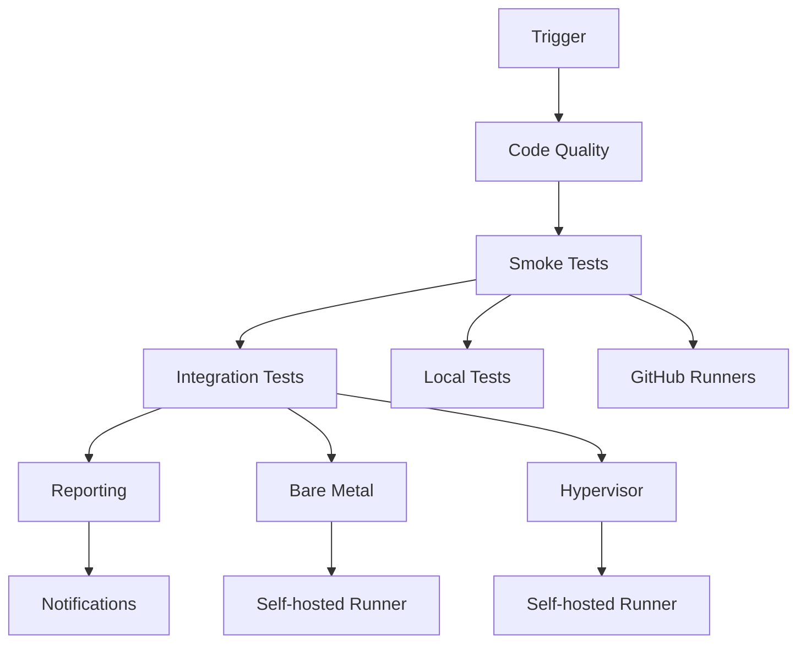
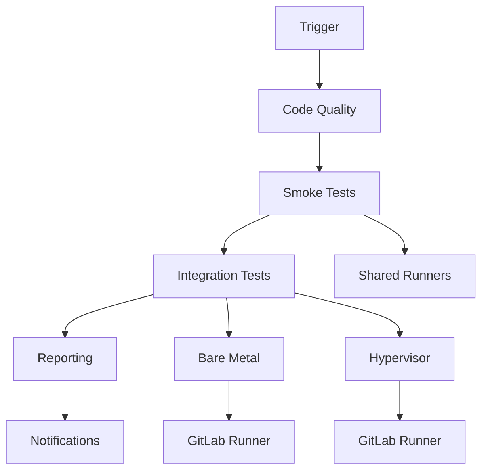

# ADR-001: Архитектура CI пайплайна для e2e тестирования модулей Deckhouse

## Статус
**Принято** - 2025-01-27

## Контекст

### Текущее состояние

Репозиторий `sds-e2e` содержит общие end-to-end тесты для различных модулей Deckhouse, включая:
- `sds-replicated-volume` (LVM, Linstor)
- `sds-node-configurator` (управление LVM Volume Groups)
- Data Export функциональность
- Другие модули, которые будут добавляться в будущем

### Технические требования

Текущие тесты требуют:
- Доступ к Kubernetes кластерам (bare metal или hypervisor)
- SSH доступ к тестовым узлам
- Go runtime для выполнения тестов
- Конфигурационные файлы для различных сред
- Лицензионные ключи Deckhouse
- Достаточные вычислительные ресурсы для виртуализации

### Бизнес-требования

1. **Автоматизация**: Полная автоматизация процесса тестирования
2. **Масштабируемость**: Легкое добавление новых модулей и тестовых сред
3. **Надежность**: Раннее обнаружение проблем и стабильные тесты
4. **Прозрачность**: Детальная отчетность и логирование
5. **Гибкость**: Возможность запуска различных комбинаций тестов
6. **Кроссплатформенность**: Поддержка GitHub CI и потенциально GitLab CI

### Ограничения

- Кодовая база модулей и тестов остается только на GitHub
- CI пайплайн может запускаться на GitHub CI и GitLab CI
- Ограниченные ресурсы для self-hosted runners
- Необходимость управления секретами и доступами
- Зависимость от внешних сервисов (кластеры, SSH)

## Решение

### Архитектура CI пайплайна

#### 1. Кроссплатформенная архитектура

**Основная платформа**: GitHub Actions
**Дополнительная платформа**: GitLab CI (для специфических сценариев)

```
Архитектура:
┌─────────────────┐    ┌─────────────────┐
│   GitHub CI     │    │   GitLab CI     │
│                 │    │                 │
│ ┌─────────────┐ │    │ ┌─────────────┐ │
│ │ Main Pipeline│ │    │ │ Main Pipeline│ │
│ └─────────────┘ │    │ └─────────────┘ │
│        │        │    │        │        │
│ ┌─────────────┐ │    │ ┌─────────────┐ │
│ │ Module Tests│ │    │ │ Module Tests│ │
│ └─────────────┘ │    │ └─────────────┘ │
│        │        │    │        │        │
│ ┌─────────────┐ │    │ ┌─────────────┐ │
│ │ Test Envs   │ │    │ │ Test Envs   │ │
│ └─────────────┘ │    │ └─────────────┘ │
└─────────────────┘    └─────────────────┘
         │                       │
         └───────────────────────┘
                    │
         ┌─────────────────────┐
         │  Shared Test Code   │
         │   (GitHub only)     │
         └─────────────────────┘
```

#### 2. Многоуровневая структура workflow

**GitHub Actions структура:**
```
.github/workflows/
├── ci-main.yml              # Основной CI пайплайн
├── modules/
│   ├── sds-replicated-volume.yml
│   ├── sds-node-configurator.yml
│   └── data-export.yml
├── environments/
│   ├── bare-metal.yml
│   ├── hypervisor.yml
│   └── local.yml
└── utils/
    ├── setup-cluster.yml
    ├── cleanup.yml
    └── reporting.yml
```

**GitLab CI структура:**
```
.gitlab-ci.yml               # Основной пайплайн
├── includes:
│   ├── modules/sds-replicated-volume.yml
│   ├── modules/sds-node-configurator.yml
│   ├── modules/data-export.yml
│   ├── environments/bare-metal.yml
│   ├── environments/hypervisor.yml
│   └── utils/
│       ├── setup-cluster.yml
│       ├── cleanup.yml
│       └── reporting.yml
```

#### 3. Стратегия запуска тестов

**Матричная стратегия** для покрытия различных комбинаций:

**GitHub Actions матрица:**
```yaml
strategy:
  fail-fast: false
  matrix:
    module: [sds-replicated-volume, sds-node-configurator, data-export]
    environment: [bare-metal, hypervisor, local]
    test_type: [smoke, integration, full]
    go_version: [1.21, 1.22]
    include:
      - module: sds-replicated-volume
        environment: local
        test_type: smoke
        go_version: 1.22
      - module: data-export
        environment: local
        test_type: smoke
        go_version: 1.22
```

**GitLab CI матрица:**
```yaml
variables:
  MODULES: "sds-replicated-volume sds-node-configurator data-export"
  ENVIRONMENTS: "bare-metal hypervisor"
  TEST_TYPES: "integration full"
  GO_VERSIONS: "1.21 1.22"

test_matrix:
  script:
    - for module in $MODULES; do
        for env in $ENVIRONMENTS; do
          for test_type in $TEST_TYPES; do
            for go_version in $GO_VERSIONS; do
              run_tests $module $env $test_type $go_version
            done
          done
        done
      done
```

**Комбинации тестирования:**
- **Модули**: sds-replicated-volume, sds-node-configurator, data-export
- **Среды**: bare-metal, hypervisor, local
- **Версии Go**: 1.21, 1.22
- **Типы тестов**: smoke, integration, full
- **Платформы**: GitHub Actions (основная), GitLab CI (дополнительная)

#### 4. Управление тестовыми средами

**Bare Metal тесты**:
- **GitHub Actions**: Self-hosted runners с предустановленными кластерами
- **GitLab CI**: GitLab runners с доступом к кластерам
- SSH туннелирование для доступа к кластерам
- Автоматическое управление namespace'ами
- Мониторинг ресурсов узлов

**Hypervisor тесты**:
- **GitHub Actions**: Self-hosted runners с поддержкой виртуализации
- **GitLab CI**: GitLab runners с доступом к hypervisor кластерам
- Создание виртуальных машин через Deckhouse
- Динамическое развертывание тестовых кластеров
- Очистка ресурсов после тестов
- Управление жизненным циклом VM

**Local тесты**:
- **GitHub Actions**: GitHub-hosted runners
- **GitLab CI**: GitLab shared runners
- Быстрые smoke тесты
- Проверка базовой функциональности
- Ограниченные ресурсы

**Детальная конфигурация сред:**

| Среда | Runner Type | Ресурсы | Время | Стоимость |
|-------|-------------|---------|-------|-----------|
| local | GitHub/GitLab hosted | 2 CPU, 7GB RAM | 5-10 мин | Низкая |
| bare-metal | Self-hosted | 8+ CPU, 16+ GB RAM | 20-60 мин | Средняя |
| hypervisor | Self-hosted | 16+ CPU, 32+ GB RAM | 30-120 мин | Высокая |

#### 5. Система конфигурации

**GitHub Actions переменные:**
```yaml
# Основные настройки
TEST_ENVIRONMENT: bare-metal|hypervisor|local
MODULE_UNDER_TEST: sds-replicated-volume|sds-node-configurator|data-export
TEST_TYPE: smoke|integration|full
GO_VERSION: 1.21|1.22

# Настройки кластера
KUBECONFIG_BARE_METAL: <base64-encoded-kubeconfig>
KUBECONFIG_HYPERVISOR: <base64-encoded-kubeconfig>
SSH_HOST: user@host
SSH_PRIVATE_KEY: <private-key>
DECKHOUSE_LICENSE: <deckhouse-license>

# Настройки тестов
TEST_NAMESPACE: test-e2e-{timestamp}
TIMEOUT: 30m|60m|120m
PARALLEL_JOBS: 4
VERBOSE: true|false
DEBUG: true|false

# Уведомления
SLACK_WEBHOOK: <slack-webhook-url>
TEAMS_WEBHOOK: <teams-webhook-url>
```

**GitLab CI переменные:**
```yaml
# Основные настройки
variables:
  TEST_ENVIRONMENT: "bare-metal"
  MODULE_UNDER_TEST: "sds-replicated-volume"
  TEST_TYPE: "integration"
  GO_VERSION: "1.22"

# Настройки кластера (через GitLab CI/CD Variables)
# KUBECONFIG_BARE_METAL (File type)
# KUBECONFIG_HYPERVISOR (File type)
# SSH_PRIVATE_KEY (File type)
# DECKHOUSE_LICENSE (Variable type)

# Настройки тестов
  TEST_NAMESPACE: "test-e2e-${CI_PIPELINE_ID}"
  TIMEOUT: "60m"
  PARALLEL_JOBS: "4"
  VERBOSE: "true"
  DEBUG: "false"

# Уведомления
# SLACK_WEBHOOK (Variable type)
# TEAMS_WEBHOOK (Variable type)
```

**Конфигурационные файлы:**

**GitHub Actions secrets:**
```bash
# Обязательные секреты
KUBECONFIG_BARE_METAL=<base64-encoded-kubeconfig>
KUBECONFIG_HYPERVISOR=<base64-encoded-kubeconfig>
SSH_PRIVATE_KEY=<private-ssh-key>
SSH_HOST=user@hostname
DECKHOUSE_LICENSE=<license-key>

# Опциональные секреты
SLACK_WEBHOOK=<slack-webhook-url>
TEAMS_WEBHOOK=<teams-webhook-url>
```

**GitLab CI/CD Variables:**
```bash
# File type variables
KUBECONFIG_BARE_METAL=<kubeconfig-file>
KUBECONFIG_HYPERVISOR=<kubeconfig-file>
SSH_PRIVATE_KEY=<private-key-file>

# Variable type variables
SSH_HOST=user@hostname
DECKHOUSE_LICENSE=<license-key>
SLACK_WEBHOOK=<slack-webhook-url>
TEAMS_WEBHOOK=<teams-webhook-url>
```

#### 6. Система отчетности

**GitHub Actions артефакты:**
```yaml
artifacts:
  - name: test-logs
    path: testkit_v2/test-results/
    retention-days: 30
  - name: test-reports
    path: test-reports/
    retention-days: 90
  - name: performance-metrics
    path: metrics/
    retention-days: 180
```

**GitLab CI артефакты:**
```yaml
artifacts:
  reports:
    junit: test-results/*.xml
  paths:
    - test-results/
    - test-reports/
    - metrics/
  expire_in: 30 days
```

**Типы отчетов:**

1. **Логи выполнения тестов**
   - Детальные логи каждого теста
   - Временные метки и длительность
   - Ошибки и предупреждения

2. **JUnit XML отчеты**
   - Стандартизированный формат
   - Интеграция с CI системами
   - Метрики успешности

3. **HTML отчеты**
   - Интерактивные дашборды
   - Визуализация результатов
   - Детальная аналитика

4. **Метрики производительности**
   - Время выполнения тестов
   - Использование ресурсов
   - Тренды производительности

**Система уведомлений:**

**GitHub Actions уведомления:**
```yaml
notifications:
  slack:
    webhook: ${{ secrets.SLACK_WEBHOOK }}
    channels:
      - '#ci-alerts'      # Критические сбои
      - '#ci-reports'     # Еженедельные отчеты
      - '#ci-success'     # Успешные релизы
  teams:
    webhook: ${{ secrets.TEAMS_WEBHOOK }}
    channels:
      - 'CI Notifications'
  github:
    issues: true          # Автоматическое создание issues
    pr_comments: true     # Комментарии в PR
```

**GitLab CI уведомления:**
```yaml
notifications:
  slack:
    webhook: $SLACK_WEBHOOK
    channels:
      - '#ci-alerts'
      - '#ci-reports'
  teams:
    webhook: $TEAMS_WEBHOOK
  gitlab:
    merge_request_events: true
    push_events: true
    issues_events: true
```

**Типы уведомлений:**
- **Критические сбои**: Немедленные уведомления о критических проблемах
- **Еженедельные отчеты**: Сводка результатов за неделю
- **Успешные релизы**: Уведомления об успешных деплоях
- **GitHub Issues**: Автоматическое создание issues для отслеживания проблем

### Детальная архитектура

#### Workflow Triggers

**GitHub Actions триггеры:**
```yaml
on:
  push:
    branches: [main, develop]
    paths:
      - 'testkit_v2/**'
      - 'images/**'
      - '.github/workflows/**'
  pull_request:
    branches: [main]
    paths:
      - 'testkit_v2/**'
      - 'images/**'
  schedule:
    - cron: '0 2 * * 1'  # Еженедельные полные тесты в понедельник в 2:00 UTC
  workflow_dispatch:
    inputs:
      module:
        description: 'Модуль для тестирования'
        required: true
        default: 'all'
        type: choice
        options:
          - all
          - sds-replicated-volume
          - sds-node-configurator
          - data-export
      environment:
        description: 'Тестовая среда'
        required: true
        default: 'bare-metal'
        type: choice
        options:
          - bare-metal
          - hypervisor
          - local
      test_type:
        description: 'Тип тестов'
        required: true
        default: 'smoke'
        type: choice
        options:
          - smoke
          - integration
          - full
      go_version:
        description: 'Версия Go'
        required: false
        default: '1.22'
        type: choice
        options:
          - '1.21'
          - '1.22'
```

**GitLab CI триггеры:**
```yaml
# .gitlab-ci.yml
stages:
  - code-quality
  - smoke-tests
  - integration-tests
  - reporting

variables:
  GIT_STRATEGY: clone
  GIT_DEPTH: 0

# Автоматические триггеры
code_quality:
  stage: code-quality
  rules:
    - if: $CI_PIPELINE_SOURCE == "push"
    - if: $CI_PIPELINE_SOURCE == "merge_request_event"
    - if: $CI_PIPELINE_SOURCE == "schedule"

smoke_tests:
  stage: smoke-tests
  rules:
    - if: $CI_PIPELINE_SOURCE == "push" && $CI_COMMIT_BRANCH =~ /^(main|develop)$/
    - if: $CI_PIPELINE_SOURCE == "merge_request_event"

integration_tests:
  stage: integration-tests
  rules:
    - if: $CI_PIPELINE_SOURCE == "push" && $CI_COMMIT_BRANCH =~ /^(main|develop)$/
    - if: $CI_PIPELINE_SOURCE == "schedule"
    - if: $CI_PIPELINE_SOURCE == "web"

# Ручной запуск
manual_tests:
  stage: integration-tests
  when: manual
  variables:
    MODULE_UNDER_TEST: "all"
    TEST_ENVIRONMENT: "bare-metal"
    TEST_TYPE: "full"
```

#### Матричная стратегия

```yaml
strategy:
  fail-fast: false
  matrix:
    module: [sds-replicated-volume, sds-node-configurator, data-export]
    environment: [bare-metal, hypervisor]
    test_type: [smoke, integration]
    include:
      - module: sds-replicated-volume
        environment: local
        test_type: smoke
      - module: data-export
        environment: local
        test_type: smoke
```

#### Этапы выполнения

1. **Setup** (2-3 минуты)
   - Проверка кода
   - Установка зависимостей
   - Подготовка конфигурации

2. **Environment Preparation** (5-15 минут)
   - Настройка кластера (для bare-metal/hypervisor)
   - Создание namespace
   - Проверка доступности ресурсов

3. **Test Execution** (10-60 минут)
   - Запуск тестов в зависимости от типа
   - Параллельное выполнение где возможно
   - Сбор метрик

4. **Reporting** (1-2 минуты)
   - Генерация отчетов
   - Загрузка артефактов
   - Отправка уведомлений

5. **Cleanup** (2-5 минут)
   - Очистка тестовых ресурсов
   - Освобождение namespace'ов

### Управление секретами

**GitHub Secrets**:
- `KUBECONFIG_BARE_METAL`: kubeconfig для bare metal кластера
- `KUBECONFIG_HYPERVISOR`: kubeconfig для hypervisor кластера
- `SSH_PRIVATE_KEY`: SSH ключ для доступа к узлам
- `DECKHOUSE_LICENSE`: лицензионный ключ Deckhouse
- `SLACK_WEBHOOK`: webhook для уведомлений в Slack

### Масштабирование

**Горизонтальное масштабирование**:
- Self-hosted runners для различных типов тестов
- Пул runners для bare metal тестов
- Отдельные runners для hypervisor тестов

**Вертикальное масштабирование**:
- Кэширование Docker образов
- Параллельное выполнение независимых тестов
- Инкрементальное тестирование (только измененные модули)

## Технические детали реализации

### Архитектура выполнения

**GitHub Actions архитектура:**


**GitLab CI архитектура:**


### Детальные этапы выполнения

#### 1. Code Quality (2-5 минут)
```yaml
steps:
  - checkout
  - setup-go
  - cache-dependencies
  - go-vet
  - go-fmt-check
  - golangci-lint
  - security-scan
```

#### 2. Smoke Tests (5-15 минут)
```yaml
# GitHub Actions
runs-on: ubuntu-latest
steps:
  - checkout
  - setup-go
  - run-smoke-tests
  - upload-artifacts

# GitLab CI
image: golang:1.22
script:
  - go test -v -timeout 10m ./tests/00_healthcheck_test.go
```

#### 3. Integration Tests (20-120 минут)
```yaml
# Bare Metal
runs-on: [self-hosted, bare-metal]
timeout-minutes: 60
steps:
  - setup-environment
  - setup-cluster
  - run-tests
  - collect-results
  - cleanup

# Hypervisor
runs-on: [self-hosted, hypervisor]
timeout-minutes: 120
steps:
  - setup-environment
  - create-vm-cluster
  - run-tests
  - collect-results
  - cleanup-vm-cluster
```

### Управление ресурсами

#### Self-hosted Runners

**Bare Metal Runners:**
```yaml
# .github/runner-labels.yml
bare-metal:
  - ubuntu-20.04
  - 8cpu-16gb
  - k8s-cluster
  - lvm-support
  - ssh-access

# Требования к железу
hardware:
  cpu: "8+ cores"
  memory: "16+ GB RAM"
  storage: "100+ GB SSD"
  network: "1+ Gbps"
```

**Hypervisor Runners:**
```yaml
hypervisor:
  - ubuntu-20.04
  - 16cpu-32gb
  - k8s-cluster
  - virtualization
  - nested-vm-support

# Требования к железу
hardware:
  cpu: "16+ cores (with VT-x/AMD-V)"
  memory: "32+ GB RAM"
  storage: "200+ GB SSD"
  network: "10+ Gbps"
  virtualization: "KVM/QEMU support"
```

#### GitLab Runners

**Bare Metal GitLab Runners:**
```toml
# /etc/gitlab-runner/config.toml
[[runners]]
  name = "bare-metal-runner"
  url = "https://gitlab.example.com/"
  token = "TOKEN"
  executor = "shell"
  shell = "bash"
  [runners.custom_build_dir]
  [runners.cache]
  [runners.custom]
    [[runners.custom.labels]]
      - "bare-metal"
      - "k8s-cluster"
      - "lvm-support"
```

**Hypervisor GitLab Runners:**
```toml
[[runners]]
  name = "hypervisor-runner"
  url = "https://gitlab.example.com/"
  token = "TOKEN"
  executor = "shell"
  shell = "bash"
  [runners.custom_build_dir]
  [runners.cache]
  [runners.custom]
    [[runners.custom.labels]]
      - "hypervisor"
      - "k8s-cluster"
      - "virtualization"
      - "nested-vm"
```

### Безопасность

#### Управление секретами

**GitHub Actions Secrets:**
```bash
# Обязательные секреты
KUBECONFIG_BARE_METAL=<base64-encoded-kubeconfig>
KUBECONFIG_HYPERVISOR=<base64-encoded-kubeconfig>
SSH_PRIVATE_KEY=<private-ssh-key>
SSH_HOST=user@hostname
DECKHOUSE_LICENSE=<license-key>

# Опциональные секреты
SLACK_WEBHOOK=<slack-webhook-url>
TEAMS_WEBHOOK=<teams-webhook-url>
```

**GitLab CI/CD Variables:**
```bash
# File type variables (зашифрованы)
KUBECONFIG_BARE_METAL=<kubeconfig-file>
KUBECONFIG_HYPERVISOR=<kubeconfig-file>
SSH_PRIVATE_KEY=<private-key-file>

# Variable type variables (зашифрованы)
SSH_HOST=user@hostname
DECKHOUSE_LICENSE=<license-key>
SLACK_WEBHOOK=<slack-webhook-url>
TEAMS_WEBHOOK=<teams-webhook-url>
```

#### Контроль доступа

**RBAC для Kubernetes:**
```yaml
# test-runner-rbac.yaml
apiVersion: rbac.authorization.k8s.io/v1
kind: ClusterRole
metadata:
  name: test-runner
rules:
- apiGroups: [""]
  resources: ["pods", "services", "persistentvolumeclaims", "persistentvolumes"]
  verbs: ["get", "list", "create", "update", "patch", "delete"]
- apiGroups: ["apps"]
  resources: ["deployments", "statefulsets"]
  verbs: ["get", "list", "create", "update", "patch", "delete"]
- apiGroups: ["storage.deckhouse.io"]
  resources: ["lvmvolumegroups", "lvmvolumes", "dataexports"]
  verbs: ["get", "list", "create", "update", "patch", "delete"]
```

**SSH доступ:**
```bash
# Ограниченный SSH доступ
Match User test-runner
    AllowUsers test-runner
    ForceCommand /usr/local/bin/test-runner-script
    PermitTunnel no
    PermitUserRC no
    X11Forwarding no
    AllowAgentForwarding no
```

#### Аудит и мониторинг

**Логирование доступа:**
```yaml
# audit-logging.yaml
apiVersion: v1
kind: ConfigMap
metadata:
  name: audit-config
data:
  audit.yaml: |
    apiVersion: audit.k8s.io/v1
    kind: Policy
    rules:
    - level: Metadata
      namespaces: ["test-e2e-*"]
      verbs: ["create", "update", "delete"]
```

**Мониторинг ресурсов:**
```yaml
# resource-monitoring.yaml
apiVersion: monitoring.coreos.com/v1
kind: ServiceMonitor
metadata:
  name: test-runner-metrics
spec:
  selector:
    matchLabels:
      app: test-runner
  endpoints:
  - port: metrics
    interval: 30s
```

## Последствия

### Положительные
- **Автоматизация**: Полная автоматизация процесса тестирования
- **Масштабируемость**: Легкое добавление новых модулей и тестовых сред
- **Надежность**: Раннее обнаружение проблем
- **Прозрачность**: Детальная отчетность и логирование
- **Гибкость**: Возможность запуска различных комбинаций тестов
- **Кроссплатформенность**: Поддержка GitHub Actions и GitLab CI
- **Безопасность**: Централизованное управление секретами и доступом

### Отрицательные
- **Сложность**: Высокая сложность настройки и поддержки
- **Ресурсы**: Требует значительных вычислительных ресурсов
- **Время**: Полный цикл тестирования может занимать 1-2 часа
- **Зависимости**: Зависимость от внешних сервисов (кластеры, SSH)
- **Стоимость**: Высокие затраты на self-hosted runners
- **Обслуживание**: Необходимость поддержки инфраструктуры

### Риски
- **Нестабильность**: Тесты могут быть нестабильными из-за сетевых проблем
- **Ресурсы**: Недостаток ресурсов может привести к блокировке CI
- **Безопасность**: Необходимость управления секретами и доступами
- **Совместимость**: Различия между GitHub Actions и GitLab CI
- **Производительность**: Деградация производительности при масштабировании

## Альтернативы

### 1. Jenkins
- **Плюсы**: Больше контроля, лучшая интеграция с bare metal
- **Минусы**: Требует собственной инфраструктуры, сложнее в настройке

### 2. GitLab CI
- **Плюсы**: Встроенная поддержка Kubernetes, хорошая интеграция
- **Минусы**: Меньше экосистемы, ограниченная поддержка self-hosted runners

### 3. Tekton
- **Плюсы**: Cloud-native подход, хорошая интеграция с Kubernetes
- **Минусы**: Высокая сложность, требует дополнительной инфраструктуры

## Реализация

### Этап 1: Базовая инфраструктура (1-2 недели)
- Создание основных workflow файлов
- Настройка self-hosted runners
- Базовая система секретов

### Этап 2: Интеграция с модулями (2-3 недели)
- Создание специфичных workflow для каждого модуля
- Интеграция с существующими тестами
- Настройка отчетности

### Этап 3: Оптимизация и масштабирование (1-2 недели)
- Оптимизация времени выполнения
- Настройка кэширования
- Мониторинг и алертинг

### Этап 4: Документация и обучение (1 неделя)
- Создание документации
- Обучение команды
- Создание runbook'ов

## Мониторинг и метрики

### Ключевые метрики

#### Производительность
```yaml
performance_metrics:
  pipeline_duration:
    target: "< 2 hours"
    alert_threshold: "> 3 hours"
    measurement: "end-to-end pipeline time"
  
  test_execution_time:
    smoke_tests: "< 15 minutes"
    integration_tests: "< 60 minutes"
    full_tests: "< 120 minutes"
  
  resource_utilization:
    cpu_usage: "< 80%"
    memory_usage: "< 85%"
    disk_usage: "< 90%"
```

#### Качество
```yaml
quality_metrics:
  test_success_rate:
    target: "> 95%"
    alert_threshold: "< 90%"
    measurement: "percentage of passing tests"
  
  flaky_test_rate:
    target: "< 5%"
    alert_threshold: "> 10%"
    measurement: "tests that pass/fail inconsistently"
  
  test_coverage:
    target: "> 80%"
    measurement: "percentage of code paths tested"
```

#### Доступность
```yaml
availability_metrics:
  cluster_uptime:
    target: "> 99%"
    alert_threshold: "< 95%"
    measurement: "test cluster availability"
  
  runner_availability:
    target: "> 95%"
    alert_threshold: "< 90%"
    measurement: "self-hosted runner availability"
  
  network_connectivity:
    target: "> 99%"
    alert_threshold: "< 95%"
    measurement: "SSH and Kubernetes connectivity"
```

### Система мониторинга

#### Prometheus метрики
```yaml
# prometheus-metrics.yaml
apiVersion: v1
kind: ConfigMap
metadata:
  name: prometheus-config
data:
  prometheus.yml: |
    global:
      scrape_interval: 15s
    scrape_configs:
    - job_name: 'ci-pipeline'
      static_configs:
      - targets: ['ci-metrics:9090']
    - job_name: 'test-clusters'
      kubernetes_sd_configs:
      - role: endpoints
        namespaces:
          names:
          - test-e2e-*
```

#### Grafana дашборды
```json
{
  "dashboard": {
    "title": "CI Pipeline Metrics",
    "panels": [
      {
        "title": "Pipeline Success Rate",
        "type": "stat",
        "targets": [
          {
            "expr": "rate(ci_pipeline_success_total[5m]) / rate(ci_pipeline_total[5m]) * 100"
          }
        ]
      },
      {
        "title": "Test Execution Time",
        "type": "graph",
        "targets": [
          {
            "expr": "histogram_quantile(0.95, rate(ci_test_duration_seconds_bucket[5m]))"
          }
        ]
      },
      {
        "title": "Resource Utilization",
        "type": "graph",
        "targets": [
          {
            "expr": "rate(ci_runner_cpu_usage[5m])"
          },
          {
            "expr": "rate(ci_runner_memory_usage[5m])"
          }
        ]
      }
    ]
  }
}
```

### Алерты

#### Критические алерты
```yaml
# critical-alerts.yaml
alerts:
  - name: "CI Pipeline Failure"
    condition: "ci_pipeline_success_rate < 0.9"
    severity: "critical"
    notification_channels:
      - slack: "#ci-alerts"
      - email: "devops@company.com"
      - pagerduty: "ci-pipeline"
  
  - name: "Test Cluster Down"
    condition: "up{job='test-clusters'} == 0"
    severity: "critical"
    notification_channels:
      - slack: "#ci-alerts"
      - pagerduty: "infrastructure"
  
  - name: "High Resource Usage"
    condition: "ci_runner_cpu_usage > 0.9 OR ci_runner_memory_usage > 0.9"
    severity: "warning"
    notification_channels:
      - slack: "#ci-warnings"
```

#### Предупреждающие алерты
```yaml
warning_alerts:
  - name: "Slow Test Execution"
    condition: "ci_test_duration_seconds > 7200"  # 2 hours
    severity: "warning"
    notification_channels:
      - slack: "#ci-warnings"
  
  - name: "High Flaky Test Rate"
    condition: "ci_flaky_test_rate > 0.1"  # 10%
    severity: "warning"
    notification_channels:
      - slack: "#ci-warnings"
  
  - name: "Low Test Coverage"
    condition: "ci_test_coverage < 0.8"  # 80%
    severity: "warning"
    notification_channels:
      - slack: "#ci-warnings"
```

### Логирование

#### Структурированные логи
```yaml
# structured-logging.yaml
apiVersion: v1
kind: ConfigMap
metadata:
  name: logging-config
data:
  log-config.yaml: |
    version: 1
    formatters:
      json:
        format: '{"timestamp": "%(asctime)s", "level": "%(levelname)s", "module": "%(name)s", "message": "%(message)s", "extra": %(extra)s}'
    handlers:
      console:
        class: logging.StreamHandler
        formatter: json
        level: INFO
      file:
        class: logging.handlers.RotatingFileHandler
        formatter: json
        filename: /var/log/ci-pipeline.log
        maxBytes: 10485760  # 10MB
        backupCount: 5
        level: DEBUG
```

#### Централизованное логирование
```yaml
# fluentd-config.yaml
apiVersion: v1
kind: ConfigMap
metadata:
  name: fluentd-config
data:
  fluent.conf: |
    <source>
      @type tail
      path /var/log/ci-pipeline.log
      pos_file /var/log/fluentd-ci-pipeline.log.pos
      tag ci.pipeline
      format json
    </source>
    
    <match ci.pipeline>
      @type elasticsearch
      host elasticsearch.logging.svc.cluster.local
      port 9200
      index_name ci-pipeline-logs
      type_name _doc
    </match>
```

## Планы развития

### Краткосрочные цели (1-3 месяца)

#### Оптимизация производительности
```yaml
performance_optimization:
  parallel_execution:
    - Параллельное выполнение независимых тестов
    - Оптимизация матричной стратегии
    - Улучшение кэширования зависимостей
  
  resource_optimization:
    - Оптимизация использования ресурсов runners
    - Улучшение очистки после тестов
    - Мониторинг и алертинг по ресурсам
  
  test_optimization:
    - Инкрементальное тестирование
    - Умное определение измененных модулей
    - Кэширование результатов тестов
```

#### Улучшение отчетности
```yaml
reporting_improvements:
  dashboards:
    - Grafana дашборды для метрик
    - Интерактивные HTML отчеты
    - Тренды производительности
  
  notifications:
    - Интеграция с Slack/Teams
    - Email уведомления
    - GitHub Issues автоматизация
  
  analytics:
    - Анализ флаки тестов
    - Предсказание сбоев
    - Рекомендации по оптимизации
```

### Среднесрочные цели (3-6 месяцев)

#### Добавление новых модулей
```yaml
new_modules:
  sds-csi-driver:
    - CSI драйвер тестирование
    - Интеграция с Kubernetes
    - Performance тесты
  
  sds-backup:
    - Backup/restore функциональность
    - Disaster recovery тесты
    - Data integrity проверки
  
  sds-monitoring:
    - Метрики и мониторинг
    - Алертинг системы
    - Dashboard тестирование
```

#### Интеграция с внешними системами
```yaml
external_integrations:
  test_management:
    - Интеграция с TestRail
    - Автоматическое создание тест-кейсов
    - Синхронизация результатов
  
  deployment:
    - Автоматический деплой после успешных тестов
    - Canary deployments
    - Rollback механизмы
  
  security:
    - SAST/DAST интеграция
    - Security scanning
    - Compliance проверки
```

### Долгосрочные цели (6+ месяцев)

#### ИИ и машинное обучение
```yaml
ai_ml_features:
  predictive_analytics:
    - Предсказание сбоев тестов
    - Оптимизация времени выполнения
    - Рекомендации по ресурсам
  
  intelligent_testing:
    - Автоматическое создание тестов
    - Умное покрытие кода
    - Адаптивное тестирование
  
  anomaly_detection:
    - Обнаружение аномалий в метриках
    - Автоматическое исправление проблем
    - Проактивный мониторинг
```

#### Облачная интеграция
```yaml
cloud_integration:
  multi_cloud:
    - Поддержка AWS, GCP, Azure
    - Кроссплатформенное тестирование
    - Облачные runners
  
  serverless:
    - Serverless тестирование
    - Event-driven архитектура
    - Pay-per-use модель
  
  edge_computing:
    - Edge deployment тестирование
    - Distributed testing
    - Low-latency проверки
```

## Метрики успеха

### KPI (Key Performance Indicators)

#### Производительность
- **Время выполнения пайплайна**: < 2 часов (цель), < 1 час (амбициозная цель)
- **Время отклика на изменения**: < 30 минут для smoke тестов
- **Параллельность**: > 80% тестов выполняются параллельно

#### Качество
- **Успешность тестов**: > 95% (цель), > 98% (амбициозная цель)
- **Флаки тесты**: < 5% (цель), < 2% (амбициозная цель)
- **Покрытие кода**: > 80% (цель), > 90% (амбициозная цель)

#### Надежность
- **Доступность системы**: > 99% (цель), > 99.9% (амбициозная цель)
- **MTTR (Mean Time To Recovery)**: < 30 минут
- **MTBF (Mean Time Between Failures)**: > 7 дней

#### Экономическая эффективность
- **Стоимость на тест**: Снижение на 20% в год
- **ROI**: Положительный ROI в течение 6 месяцев
- **Автоматизация**: > 90% процессов автоматизированы

## Заключение

### Достигнутые цели

Предложенная архитектура обеспечивает:

1. **Полную автоматизацию e2e тестирования**
   - Автоматические триггеры на изменения кода
   - Матричное тестирование различных комбинаций
   - Автоматическая очистка и восстановление

2. **Масштабируемость для новых модулей**
   - Модульная архитектура workflow
   - Легкое добавление новых тестовых сред
   - Гибкая конфигурация

3. **Кроссплатформенность**
   - Поддержка GitHub Actions (основная)
   - Поддержка GitLab CI (дополнительная)
   - Единая кодовая база тестов

4. **Детальную отчетность и мониторинг**
   - Комплексная система метрик
   - Интерактивные дашборды
   - Проактивные алерты

5. **Безопасность и контроль доступа**
   - Централизованное управление секретами
   - RBAC для Kubernetes
   - Аудит и логирование

### Ключевые преимущества

- **Снижение времени разработки**: Автоматическое обнаружение проблем
- **Повышение качества**: Комплексное тестирование всех сценариев
- **Улучшение надежности**: Раннее обнаружение регрессий
- **Оптимизация ресурсов**: Эффективное использование инфраструктуры
- **Упрощение поддержки**: Автоматизированные процессы

### Путь вперед

Реализация будет проводиться поэтапно:

1. **Фаза 1** (1-2 месяца): Базовая инфраструктура GitHub Actions
2. **Фаза 2** (2-3 месяца): Интеграция с GitLab CI и оптимизация
3. **Фаза 3** (3-6 месяцев): Расширенная отчетность и новые модули
4. **Фаза 4** (6+ месяцев): ИИ/ML функции и облачная интеграция

Каждая фаза будет включать детальную оценку результатов, обратную связь от команды и корректировку планов на основе полученного опыта.

### Риски и митигация

**Основные риски:**
- Сложность настройки и поддержки
- Высокие затраты на инфраструктуру
- Зависимость от внешних сервисов

**Стратегии митигации:**
- Поэтапная реализация с валидацией на каждом этапе
- Автоматизация процессов настройки и поддержки
- Резервирование критических компонентов
- Регулярный мониторинг и оптимизация затрат

Данная архитектура закладывает прочную основу для долгосрочного развития системы e2e тестирования, обеспечивая высокое качество, надежность и эффективность процесса разработки.
