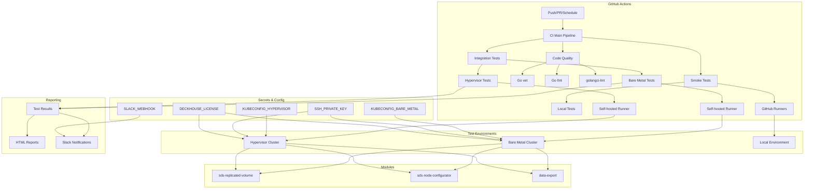
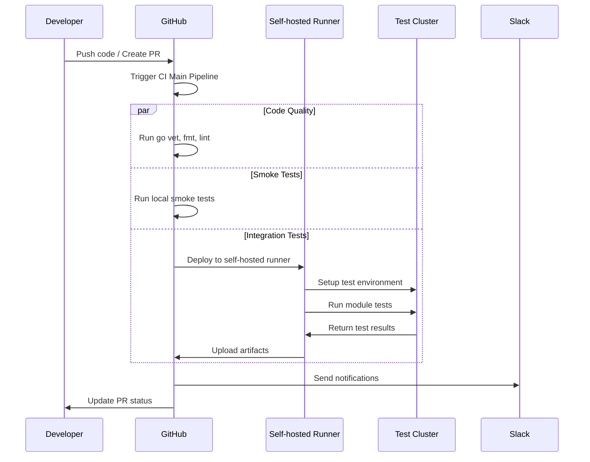
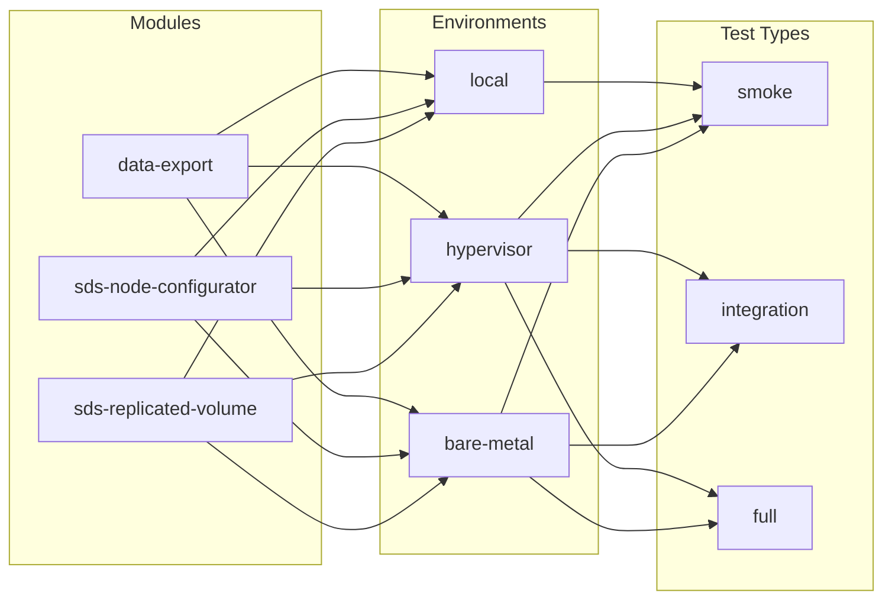
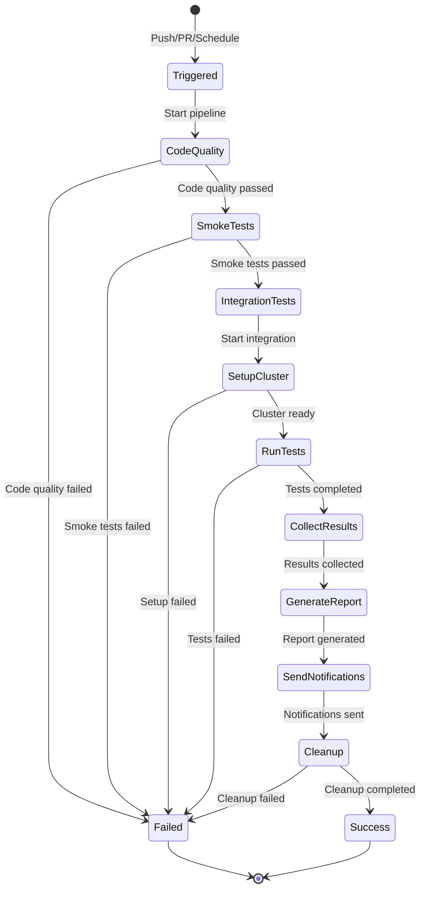

# Архитектура CI пайплайна

## Диаграмма архитектуры



## Поток выполнения



## Матрица тестирования



## Компоненты системы

### 1. Workflow файлы

```
.github/workflows/
├── ci-main.yml              # Главный координатор
├── modules/
│   ├── sds-replicated-volume.yml
│   ├── sds-node-configurator.yml
│   └── data-export.yml
└── utils/
    ├── setup-cluster.yml
    ├── cleanup.yml
    └── reporting.yml
```

### 2. Тестовые среды

| Среда | Runner | Кластер | Время | Ресурсы |
|-------|--------|---------|-------|---------|
| local | GitHub-hosted | N/A | 5-10 мин | Ограниченные |
| bare-metal | Self-hosted | Физический | 20-60 мин | Полные |
| hypervisor | Self-hosted | Виртуальный | 30-120 мин | VM |

### 3. Типы тестов

| Тип | Описание | Время | Покрытие |
|-----|----------|-------|----------|
| smoke | Базовые проверки | 5-15 мин | Основная функциональность |
| integration | Интеграционные тесты | 20-60 мин | Взаимодействие компонентов |
| full | Полный набор | 60-120 мин | Все сценарии + edge cases |

## Жизненный цикл теста



## Мониторинг и метрики

### Ключевые метрики

1. **Время выполнения**
   - Общее время пайплайна
   - Время каждого этапа
   - Время тестов по модулям

2. **Успешность**
   - Процент успешных тестов
   - Количество флаки тестов
   - Стабильность по модулям

3. **Ресурсы**
   - Использование CPU/памяти
   - Количество узлов
   - Доступность кластеров

### Алерты

- Критические сбои в основных модулях
- Превышение времени выполнения
- Недоступность тестовых сред
- Проблемы с ресурсами

## Безопасность

### Управление секретами

- GitHub Secrets для конфигураций кластеров
- SSH ключи для доступа к узлам
- Лицензионные ключи Deckhouse
- Webhook URL для уведомлений

### Контроль доступа

- RBAC для Kubernetes кластеров
- Ограниченный SSH доступ
- Изоляция тестовых namespace
- Аудит доступа

## Масштабирование

### Горизонтальное

- Self-hosted runners для различных типов тестов
- Пул runners для bare metal тестов
- Отдельные runners для hypervisor тестов

### Вертикальное

- Кэширование Docker образов
- Параллельное выполнение независимых тестов
- Инкрементальное тестирование

## Развитие

### Планы развития

1. **Краткосрочные (1-2 месяца)**
   - Оптимизация времени выполнения
   - Улучшение отчетности
   - Добавление метрик

2. **Среднесрочные (3-6 месяцев)**
   - Добавление новых модулей
   - Интеграция с другими системами
   - Автоматическое масштабирование

3. **Долгосрочные (6+ месяцев)**
   - ML для предсказания сбоев
   - Автоматическое исправление проблем
   - Интеграция с мониторингом
