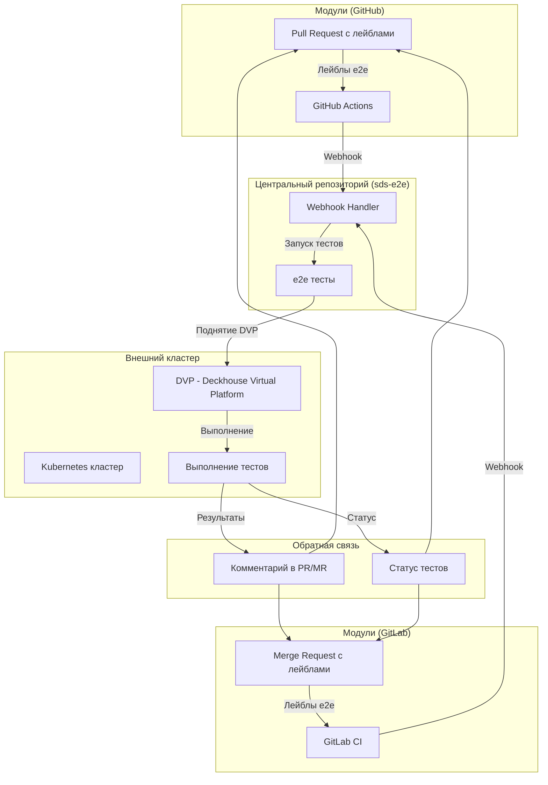
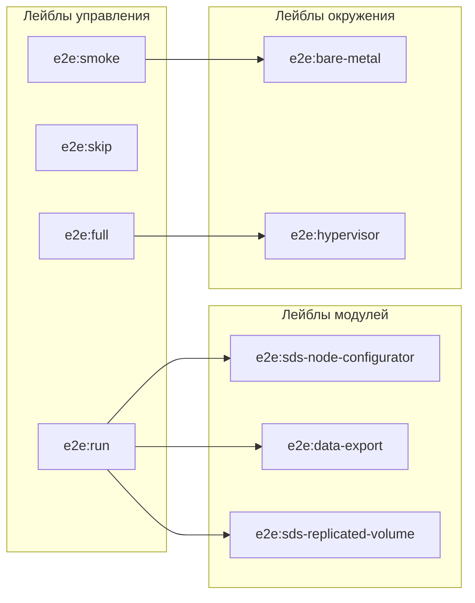
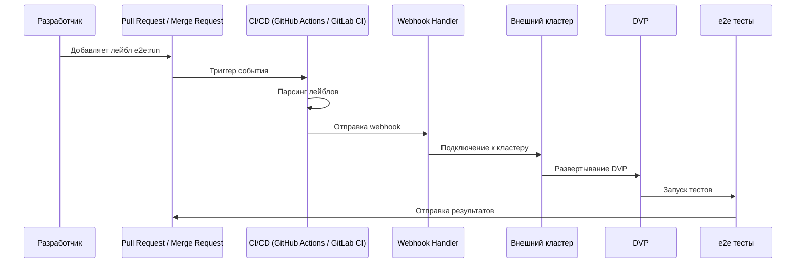

# Архитектура интеграции e2e тестов через лейблы

## Обзор архитектуры



## Детальная архитектура

### 1. Система лейблов



### 2. Workflow выполнения



### 3. Компоненты системы

#### GitHub Actions в модуле (GitHub)
```yaml
# Основные компоненты:
- Парсинг лейблов PR
- Валидация лейблов
- Отправка webhook в sds-e2e
- Обработка результатов
```

#### GitLab CI в модуле (GitLab)
```yaml
# Основные компоненты:
- Парсинг лейблов MR
- Валидация лейблов
- Отправка webhook в sds-e2e
- Обработка результатов
```

#### Webhook Handler в sds-e2e
```yaml
# Основные компоненты:
- Получение webhook от GitHub и GitLab
- Валидация payload
- Запуск тестов на внешнем кластере
- Отправка результатов в PR/MR
```

#### Внешний кластер
```yaml
# Основные компоненты:
- Kubernetes кластер
- DVP (Deckhouse Virtual Platform)
- Ресурсы для выполнения тестов
- Мониторинг и логирование
```

## Примеры использования

### Пример 1: Smoke тесты для sds-node-configurator (GitHub)
```bash
# Лейблы в PR:
- e2e:run
- e2e:smoke
- e2e:sds-node-configurator
- e2e:bare-metal
```

### Пример 2: Полные тесты для data-export (GitLab)
```bash
# Лейблы в MR:
- e2e:run
- e2e:full
- e2e:data-export
- e2e:hypervisor
```

### Пример 3: Пропуск тестов (GitHub/GitLab)
```bash
# Лейблы в PR/MR:
- e2e:skip
```

### Пример 4: Высокий приоритет (GitLab)
```bash
# Лейблы в MR:
- e2e:run
- e2e:smoke
- e2e:sds-node-configurator
- e2e:priority:high
```

## Безопасность

### Доступ к внешнему кластеру
- Использование GitHub Secrets для хранения kubeconfig
- RBAC для ограничения доступа
- Временные токены для выполнения тестов

### Изоляция тестов
- Отдельные namespace для каждого запуска
- Очистка ресурсов после выполнения
- Лимиты ресурсов для тестов

## Мониторинг

### Метрики
- Количество запусков по лейблам
- Время выполнения тестов
- Процент успешных тестов
- Использование ресурсов кластера

### Логирование
- Централизованное логирование в sds-e2e
- Структурированные логи для анализа
- Интеграция с системами мониторинга

## Масштабирование

### Горизонтальное масштабирование
- Несколько внешних кластеров
- Балансировка нагрузки
- Географическое распределение

### Вертикальное масштабирование
- Увеличение ресурсов кластера
- Оптимизация DVP
- Кэширование образов
