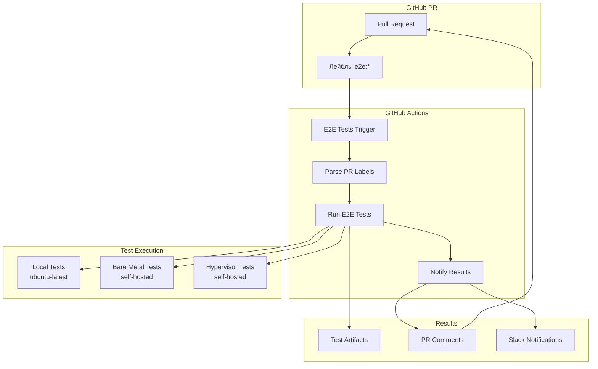
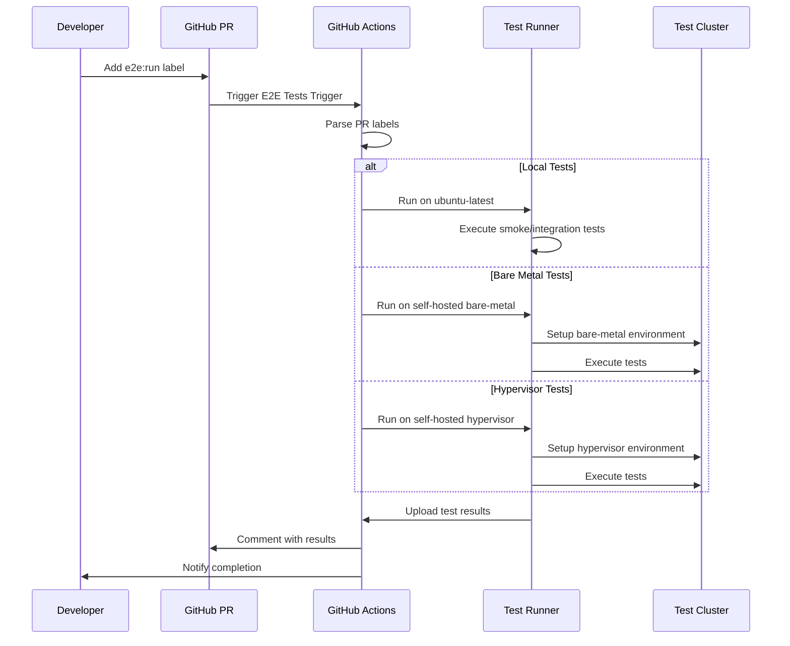
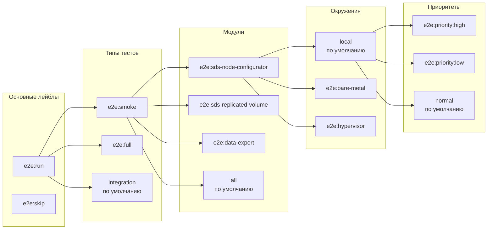
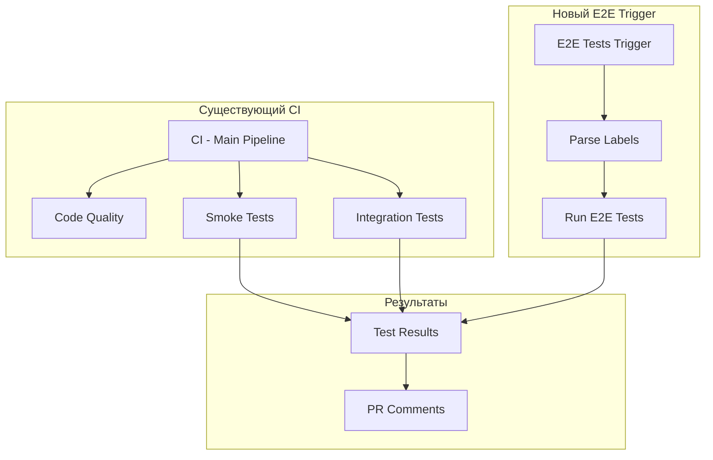

# Архитектура E2E тестов через лейблы

## Диаграмма архитектуры



## Поток выполнения



## Матрица лейблов



## Компоненты системы

### 1. Workflow файлы

```
.github/workflows/
├── ci-main.yml              # Основной CI (существующий)
├── e2e-trigger.yml          # Новый: E2E через лейблы
└── utils/
    ├── setup-cluster.yml
    ├── cleanup.yml
    └── reporting.yml
```

### 2. Лейблы GitHub

| Категория | Лейбл | Описание |
|-----------|-------|----------|
| **Основные** | `e2e:run` | Запустить E2E тесты |
| | `e2e:skip` | Пропустить E2E тесты |
| **Типы** | `e2e:smoke` | Smoke тесты |
| | `e2e:full` | Полные тесты |
| **Модули** | `e2e:sds-node-configurator` | Тесты sds-node-configurator |
| | `e2e:sds-replicated-volume` | Тесты sds-replicated-volume |
| | `e2e:data-export` | Тесты data-export |
| **Окружения** | `e2e:bare-metal` | Bare-metal окружение |
| | `e2e:hypervisor` | Hypervisor окружение |
| **Приоритеты** | `e2e:priority:high` | Высокий приоритет |
| | `e2e:priority:low` | Низкий приоритет |

### 3. Runners

| Тип | Лейблы | Использование |
|------|--------|---------------|
| **GitHub-hosted** | `ubuntu-latest` | Локальные тесты |
| **Self-hosted** | `self-hosted`, `bare-metal` | Bare-metal тесты |
| **Self-hosted** | `self-hosted`, `hypervisor` | Hypervisor тесты |

## Логика принятия решений

### Условия запуска

```yaml
if: needs.parse-labels.outputs.run-e2e == 'true' && needs.parse-labels.outputs.skip-e2e == 'false'
```

### Матрица выполнения

```yaml
strategy:
  matrix:
    include:
      - module: ${{ needs.parse-labels.outputs.module }}
        environment: ${{ needs.parse-labels.outputs.environment }}
        test_type: ${{ needs.parse-labels.outputs.test_type }}
```

### Параметры по умолчанию

| Параметр | Значение по умолчанию | Лейбл для изменения |
|----------|----------------------|-------------------|
| `module` | `all` | `e2e:*` |
| `environment` | `local` | `e2e:*` |
| `test_type` | `integration` | `e2e:*` |
| `priority` | `normal` | `e2e:priority:*` |

## Интеграция с существующим CI

### Параллельное выполнение



### Совместимость

- ✅ **Не нарушает** существующий CI
- ✅ **Дополняет** функциональность
- ✅ **Опциональное** использование
- ✅ **Обратная совместимость**

## Мониторинг и отчетность

### Метрики

- Количество запусков по лейблам
- Время выполнения тестов
- Процент успешных тестов
- Использование ресурсов

### Уведомления

- Комментарии в PR
- Slack уведомления
- Email уведомления
- GitHub status checks

## Безопасность

### Доступ к секретам

- `KUBECONFIG_BARE_METAL` - доступ к bare-metal кластеру
- `KUBECONFIG_HYPERVISOR` - доступ к hypervisor кластеру
- `SSH_PRIVATE_KEY` - SSH доступ к узлам
- `DECKHOUSE_LICENSE` - лицензия Deckhouse

### Изоляция тестов

- Отдельные namespace для каждого запуска
- Автоматическая очистка ресурсов
- Ограничение времени выполнения
- Мониторинг использования ресурсов

## Масштабирование

### Горизонтальное масштабирование

- Добавление новых self-hosted runners
- Распределение нагрузки между runners
- Автоматическое масштабирование кластеров

### Вертикальное масштабирование

- Увеличение ресурсов runners
- Оптимизация тестов
- Кэширование зависимостей

## Troubleshooting

### Частые проблемы

1. **Тесты не запускаются**
   - Проверить наличие лейбла `e2e:run`
   - Убедиться в отсутствии лейбла `e2e:skip`

2. **Неправильное окружение**
   - Проверить правильность лейблов
   - Убедиться в доступности runners

3. **Ошибки доступа**
   - Проверить настройку секретов
   - Убедиться в правильности kubeconfig

### Отладка

- Логи в GitHub Actions
- Проверка статуса runners
- Мониторинг ресурсов кластера
- Анализ артефактов тестов
