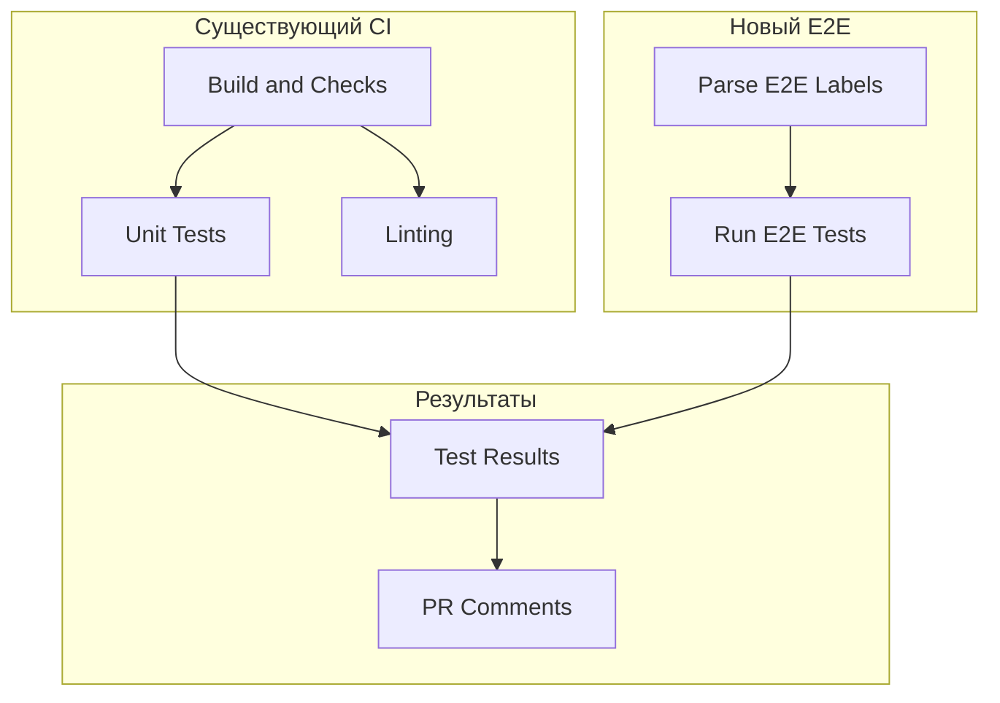

# Руководство по интеграции E2E тестов в модули

## 🎯 Цель

Интегрировать запуск e2e тестов в существующие CI/CD пайплайны модулей Deckhouse через лейблы GitHub, не нарушая существующую логику сборки.

## 📋 Предварительные требования

### 1. Создание лейблов в репозитории модуля

Перейдите в **Settings** → **Labels** и создайте следующие лейблы:

#### Основные лейблы:
- `e2e:run` - запустить e2e тесты
- `e2e:skip` - пропустить e2e тесты

#### Лейблы типа тестов:
- `e2e:smoke` - запустить только smoke тесты
- `e2e:full` - запустить полный набор тестов

#### Лейблы окружения:
- `e2e:bare-metal` - тесты на bare-metal
- `e2e:hypervisor` - тесты на hypervisor

#### Лейблы приоритета:
- `e2e:priority:high` - высокий приоритет
- `e2e:priority:low` - низкий приоритет

### 2. Настройка секретов

Добавьте следующие секреты в настройки репозитория (**Settings** → **Secrets and variables** → **Actions**):

```bash
# Токен для доступа к репозиторию sds-e2e
E2E_TRIGGER_TOKEN=<github-token-with-repo-access>

# Конфигурации кластеров (base64 encoded)
KUBECONFIG_BARE_METAL=<base64-encoded-kubeconfig>
KUBECONFIG_HYPERVISOR=<base64-encoded-kubeconfig>

# SSH доступ
SSH_PRIVATE_KEY=<private-ssh-key>
SSH_HOST=user@hostname

# Лицензия Deckhouse
DECKHOUSE_LICENSE=<license-key>
```

## 🔧 Интеграция в существующие workflow'ы

### Шаг 1: Добавление job'ов в существующий workflow

Скопируйте содержимое файла `templates/module-e2e-integration.yml` и добавьте job'ы в ваш существующий workflow файл (например, `.github/workflows/ci.yml`).

### Шаг 2: Настройка зависимостей

Добавьте зависимости от существующих job'ов сборки:

```yaml
run-e2e-tests:
  name: Run E2E Tests
  needs: [parse-e2e-labels, build-and-checks] # Добавить зависимости от job'ов сборки
  # ... остальная конфигурация
```

### Шаг 3: Настройка runners

Убедитесь, что у вас настроены self-hosted runners с соответствующими лейблами:

- `self-hosted` - базовый лейбл
- `bare-metal` - для bare-metal тестов
- `hypervisor` - для hypervisor тестов

## 📝 Примеры интеграции

### Пример 1: sds-node-configurator

```yaml
# .github/workflows/ci.yml в репозитории sds-node-configurator
name: CI

on:
  push:
    branches: [main, develop]
  pull_request:
    branches: [main]

jobs:
  # Существующие job'ы сборки
  build-and-checks:
    name: Build and Checks
    runs-on: ubuntu-latest
    steps:
      # ... существующие шаги сборки

  # Добавляем новые job'ы для e2e тестов
  parse-e2e-labels:
    name: Parse E2E Labels
    runs-on: ubuntu-latest
    if: github.event_name == 'pull_request'
    outputs:
      run-e2e: ${{ steps.parse.outputs.run-e2e }}
      skip-e2e: ${{ steps.parse.outputs.skip-e2e }}
      test-type: ${{ steps.parse.outputs.test-type }}
      environment: ${{ steps.parse.outputs.environment }}
      priority: ${{ steps.parse.outputs.priority }}
    steps:
      # ... содержимое из шаблона

  run-e2e-tests:
    name: Run E2E Tests
    runs-on: ${{ needs.parse-e2e-labels.outputs.environment == 'local' && 'ubuntu-latest' || 'self-hosted' }}
    needs: [parse-e2e-labels, build-and-checks] # Зависимость от сборки
    if: needs.parse-e2e-labels.outputs.run-e2e == 'true' && needs.parse-e2e-labels.outputs.skip-e2e == 'false'
    steps:
      # ... содержимое из шаблона
```

### Пример 2: data-export

```yaml
# .github/workflows/ci.yml в репозитории data-export
name: Data Export CI

on:
  push:
    branches: [main, develop]
  pull_request:
    branches: [main]

jobs:
  # Существующие job'ы
  go-checks:
    name: Go Checks
    runs-on: ubuntu-latest
    steps:
      # ... существующие шаги

  build-image:
    name: Build Image
    runs-on: ubuntu-latest
    needs: [go-checks]
    steps:
      # ... существующие шаги

  # Добавляем e2e тесты
  parse-e2e-labels:
    # ... содержимое из шаблона

  run-e2e-tests:
    name: Run E2E Tests
    needs: [parse-e2e-labels, go-checks, build-image] # Зависимость от всех job'ов
    # ... остальная конфигурация
```

## 🚀 Использование

### 1. Добавление лейблов в PR

1. Откройте PR в GitHub
2. Нажмите на иконку лейблов (🏷️) рядом с заголовком
3. Выберите нужные лейблы:
   - `e2e:run` - для запуска тестов
   - `e2e:smoke` - для быстрых тестов
   - `e2e:bare-metal` - для тестов на bare-metal

### 2. Мониторинг выполнения

1. Перейдите в **Actions** вкладку
2. Найдите workflow с e2e тестами
3. Отслеживайте прогресс выполнения
4. Результаты появятся в комментариях к PR

## 🔄 Логика работы

### Условия запуска

E2E тесты запускаются только при выполнении условий:
- ✅ Присутствует лейбл `e2e:run`
- ✅ Отсутствует лейбл `e2e:skip`
- ✅ PR находится в состоянии `pull_request`
- ✅ Успешно выполнены job'ы сборки

### Матрица выполнения

```yaml
strategy:
  matrix:
    include:
      - environment: ${{ needs.parse-e2e-labels.outputs.environment }}
        test_type: ${{ needs.parse-e2e-labels.outputs.test_type }}
```

### Параметры по умолчанию

| Параметр | Значение по умолчанию | Лейбл для изменения |
|----------|----------------------|-------------------|
| `environment` | `local` | `e2e:*` |
| `test_type` | `integration` | `e2e:*` |
| `priority` | `normal` | `e2e:priority:*` |

## 🐛 Отладка

### Проверка лейблов

```bash
# Проверить лейблы PR через GitHub CLI
gh pr view <PR_NUMBER> --json labels --jq '.labels[].name'
```

### Логи выполнения

1. Перейдите в **Actions** → выберите workflow
2. Найдите job **Parse E2E Labels**
3. Проверьте логи парсинга лейблов
4. Найдите job **Run E2E Tests**
5. Проверьте логи выполнения тестов

### Частые проблемы

#### Тесты не запускаются
- ✅ Проверьте наличие лейбла `e2e:run`
- ✅ Убедитесь, что нет лейбла `e2e:skip`
- ✅ Проверьте, что job'ы сборки успешно выполнены

#### Неправильное окружение
- ✅ Проверьте правильность написания лейблов
- ✅ Убедитесь, что лейблы существуют в репозитории
- ✅ Проверьте настройку self-hosted runners

#### Ошибки доступа
- ✅ Проверьте настройку секретов
- ✅ Убедитесь в правильности kubeconfig
- ✅ Проверьте доступ к репозиторию sds-e2e

## 📊 Мониторинг и метрики

### Статистика использования

- Количество запусков по лейблам
- Время выполнения тестов
- Процент успешных тестов
- Популярные комбинации лейблов

### Уведомления

- ✅ Комментарии в PR с результатами
- ✅ Slack уведомления (при настройке)
- ✅ Email уведомления (при настройке)

## 🔄 Совместимость

### Интеграция с существующим CI

- ✅ **Не нарушает** существующие workflow'ы
- ✅ **Дополняет** функциональность
- ✅ **Опциональное** использование
- ✅ **Обратная совместимость**

### Параллельное выполнение



## 📝 Best Practices

### Рекомендуемые комбинации

```bash
# Для быстрой проверки
e2e:run, e2e:smoke

# Для полного тестирования
e2e:run, e2e:full, e2e:bare-metal

# Для критических изменений
e2e:run, e2e:full, e2e:bare-metal, e2e:priority:high

# Для пропуска тестов
e2e:skip
```

### Избегайте

- ❌ Одновременное использование `e2e:run` и `e2e:skip`
- ❌ Несуществующие лейблы
- ❌ Противоречивые комбинации

## 🆘 Поддержка

При возникновении проблем:

1. Проверьте логи в **Actions**
2. Убедитесь в правильности лейблов
3. Обратитесь к команде разработки
4. Создайте issue с описанием проблемы
